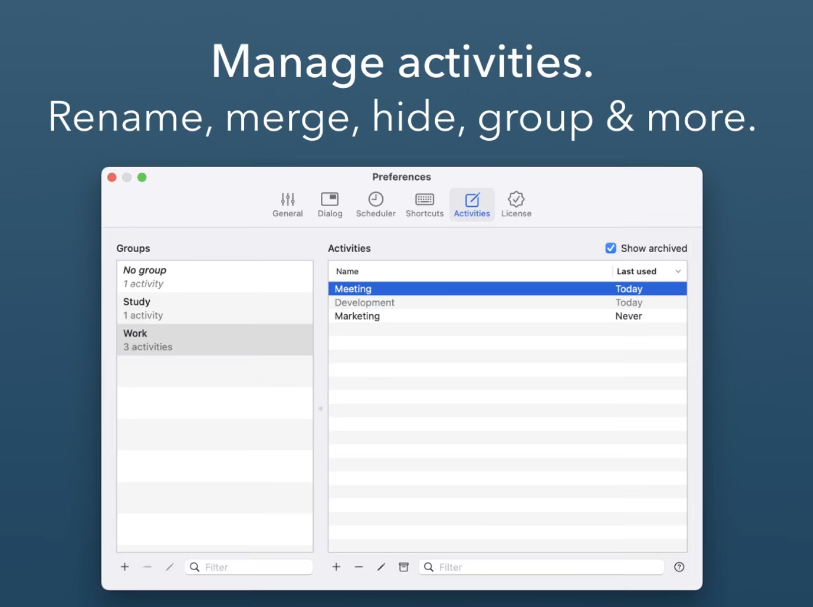

# Daily - macOS Time-Tracking App

A native macOS time-tracking application built with **Rust**, inspired by the philosophy of sampling-based time tracking. Daily helps you maintain focus and accountability by periodically prompting you to input what task you're working on—eliminating the need for manual timers.



## ✨ Features

### 🕒 **Sampling-Based Time Tracking**
- **Smart Prompts**: Periodic notifications asking "What are you working on?" (default: every 20 minutes)
- **Customizable Intervals**: Adjust prompt frequency to match your workflow
- **Working Hours**: Configure when tracking should be active
- **Silent Mode**: Non-intrusive tracking that doesn't disrupt your focus

### 💻 **Native macOS Integration**
- **Status Bar App**: Lives in your macOS menu bar for instant access
- **Light & Dark Mode**: Automatically adapts to your system appearance
- **Native UI**: Built with Tauri for a truly native macOS experience
- **Keyboard Shortcuts**: Quick access via customizable hotkeys

### 📋 **Timesheet Management**
- **View & Edit**: Review and modify your tracked activities
- **Smart Organization**: Rename, merge, group, and hide similar activities
- **Export Options**: Generate reports in CSV, JSON, and PDF formats
- **Activity History**: Complete timeline of your work patterns

### ⚙️ **Productivity & Automation**
- **Inactivity Detection**: Automatically handle idle time
- **iCloud Sync**: Keep data synchronized across all your Apple devices
- **AppleScript Support**: Automate workflows with custom scripts
- **Flexible Scheduling**: Define when and how often you want to be prompted

### 🔐 **Privacy-First Design**
- **Local Storage**: All data stored securely on your device
- **No App Tracking**: We don't monitor which apps or websites you use
- **Encrypted Sync**: Data is encrypted both locally and during iCloud synchronization
- **Complete Control**: You own your data, always

## 🚀 Quick Start

### Prerequisites
- macOS 11.0 (Big Sur) or later
- Rust 1.70+ (for development)

### Installation

#### Download Release (Recommended)
1. Download the latest release from [Releases](https://github.com/username/daily/releases)
2. Drag `Daily.app` to your Applications folder
3. Launch Daily from Applications or Spotlight

#### Build from Source
```bash
# Clone the repository
git clone https://github.com/username/daily.git
cd daily

# Install dependencies and build
cargo build --release

# Run the app
cargo run
```

### First Setup
1. **Launch Daily** - The app will appear in your menu bar
2. **Configure Intervals** - Set your preferred prompt frequency (default: 20 minutes)
3. **Set Working Hours** - Define when you want to receive tracking prompts
4. **Start Tracking** - Begin receiving periodic prompts about your activities

## 📖 Usage

### Basic Workflow
1. **Receive Prompt** - Daily will ask "What are you working on?" at your configured intervals
2. **Enter Activity** - Type what you're currently doing (e.g., "Email", "Design review", "Coding")
3. **Continue Working** - Focus on your task until the next prompt
4. **Review Timesheets** - Access your activity log via the menu bar icon

### Menu Bar Actions
- **📊 View Timesheets** - See your activity history and time breakdown
- **⚙️ Preferences** - Adjust settings and intervals
- **📤 Export Data** - Generate reports in various formats
- **⏸️ Pause Tracking** - Temporarily disable prompts

### Keyboard Shortcuts
- `Cmd+Shift+T` - Quick activity entry
- `Cmd+Shift+P` - Pause/resume tracking
- `Cmd+Shift+S` - View current session summary

## 🛠️ Development

This project follows strict development standards for code quality and maintainability.

### Development Setup
```bash
# Clone and setup
git clone https://github.com/username/daily.git
cd daily

# Install dependencies
cargo build

# Run development version
cargo run

# Run tests
cargo test

# Format code
cargo fmt

# Lint code
cargo clippy -- -D warnings
```

### Project Structure
```
daily/
├── src/
│   ├── main.rs              # Application entry point
│   ├── scheduler/           # Background scheduling logic
│   ├── database/            # SQLite data management
│   ├── ui/                  # Tauri frontend components
│   ├── export/              # Data export functionality
│   └── sync/                # iCloud synchronization
├── screenshots/             # UI reference images
├── SPECS.md                 # Detailed feature specifications
├── PLAN.md                  # Development roadmap and progress
├── AGENTS.md               # Development guidelines
└── README.md               # This file
```

### Technology Stack
- **Backend**: Rust with native macOS framework bindings
- **Frontend**: Tauri for cross-platform UI with native performance
- **Database**: SQLite for local data storage
- **Sync**: Native macOS APIs for iCloud integration
- **UI Framework**: Native macOS controls with Tauri webview

### Contributing
1. **Read Guidelines** - Check `AGENTS.md` for development standards
2. **Follow the Plan** - See `PLAN.md` for current development priorities
3. **Code Standards** - All code must pass `cargo fmt` and `cargo clippy`
4. **Testing** - Include tests for new functionality
5. **Documentation** - Update relevant documentation for changes

### Development Progress
All major features have been implemented and tested:
- ✅ Project Setup & Infrastructure
- ✅ Core Sampling-Based Tracking
- ✅ Native macOS User Interface
- ✅ Timesheet Management & Export
- ✅ Productivity & Automation Features
- ✅ Privacy & Security Implementation
- ✅ Testing & Quality Assurance

See `PLAN.md` for detailed progress tracking and next steps.

## 📋 Requirements

### System Requirements
- **macOS**: 11.0 (Big Sur) or later
- **Memory**: 50MB RAM
- **Storage**: 100MB available space
- **Permissions**: Accessibility access (for inactivity detection)

### Optional Integrations
- **iCloud**: For cross-device synchronization
- **AppleScript**: For workflow automation

## 🔧 Configuration

Daily stores its configuration in `~/Library/Application Support/Daily/`. Key settings include:

- **Prompt Interval**: How often you receive tracking prompts
- **Working Hours**: When tracking is active
- **Activity Categories**: Custom tags for organizing work
- **Export Preferences**: Default formats and destinations
- **Sync Settings**: iCloud synchronization options

## 📊 Data Export

Daily supports multiple export formats:

### CSV Export
```csv
Date,Time,Activity,Duration,Category
2025-06-27,09:00,Email,00:20,Communication
2025-06-27,09:20,Coding,01:15,Development
```

### JSON Export
```json
{
  "date": "2025-06-27",
  "activities": [
    {
      "time": "09:00",
      "activity": "Email",
      "duration": "00:20",
      "category": "Communication"
    }
  ]
}
```

### PDF Reports
Professional timesheet reports with charts and summaries.

## 🤝 Support

- **Documentation**: Check `SPECS.md` for detailed feature descriptions
- **Issues**: Report bugs via GitHub Issues
- **Discussions**: Feature requests and general questions
- **Screenshots**: See `screenshots/` folder for UI references

## 📄 License

This project is licensed under the MIT License - see the [LICENSE](LICENSE) file for details.

## 🙏 Acknowledgments

- Inspired by the **Daily** time-tracking methodology
- Built with the amazing Rust and Tauri ecosystems
- Thanks to the macOS development community for native integration patterns

---

**Daily** - Simple, private, effective time tracking for macOS. Focus on your work, let Daily track your time.
